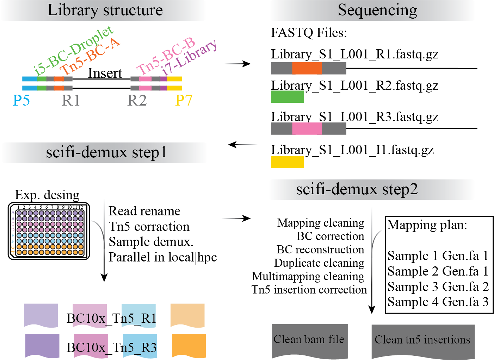

# scifi-demux: Demultiplexing & Preprocessing for sci-fi ATAC-seq

[](https://github.com/gomezcan/scifi-demux/actions/workflows/test.yml)


<p align="center">
  
</p>


`scifi-demux` is a typed CLI toolkit for **renaming**, **demultiplexing**, and **mapping/cleaning** sci-fi ATAC-seq FASTQs.  
It wraps existing bioinformatics tools in a reproducible, resumable, QC-aware framework.

- Single CLI (`scifi-demux …`) with subcommands:
  - **Step 1**: UMI → cutadapt → demux → merge
  - **Step 2**: map → clean
- Runs in both **local (GNU parallel)** and **HPC (SLURM array)** modes
- Supports **design files** (for pooling/grouping) or defaults to per-well demux
- Generates built-in **QC summaries** and integrates with **MultiQC**


## Installation

We recommend using conda/mamba so you get the bioinformatics tools (UMI-tools, cutadapt, bwa, samtools, picard, seqkit, GNU parallel, MultiQC) alongside the Python CLI.

```
# Clone the rep
git clone https://github.com/gomezcan/scifi-demux
cd scifi-demux
```

### Option A — Fresh environment (recommended)

#### 1) Configure channels (once):

```
conda config --add channels conda-forge
conda config --add channels bioconda
conda config --set channel_priority strict
```

#### 2) Create and activate the env (fast with mamba):

```
# If you have mamba:
mamba create -n scifi-demux \
  python=3.11 umi_tools cutadapt seqkit samtools bwa picard pigz parallel multiqc -y
conda activate scifi-demux
```

```
# With conda:
conda create -n scifi-demux python=3.11 umi_tools cutadapt seqkit samtools bwa picard pigz parallel multiqc -y
conda activate scifi-demux
```

```
# or used environment.yml
conda env create -n scifi-demux -f environment.yml
conda activate scifi-demux
```

#### 3) Install the Python package (editable dev mode):

```
pip install -e .
```

### Option B — Install into an existing conda env
```
conda activate <your-env>
# (optional) add channels once per machine
conda config --add channels conda-forge
conda config --add channels bioconda
conda config --set channel_priority strict

# install (from the repo you cloned)
pip install -e /path/to/scifi-demux
# or straight from GitHub
pip install "git+https://github.com/gomezcan/scifi-demux.git"
```

#### 4) Verify the install
```
scifi-demux --help
umi_tools --version
cutadapt --version
samtools --version | head -1
bwa 2>&1 | head -1
parallel --version | head -1
multiqc --version
```

#### Uninstall

```bash
pip uninstall -y scifi-demux
```

If you also created a dedicated conda/mamba environment

```bash
conda deactivate
conda env remove -n scifi-demux
```

## Quick start

> The CLI is being built in two stages:
>  - "**Step 1**: UMI → cutadapt → (chunk) demux → merge → QC"
>  - "**Step 2**: genome index resolve/build → mapping → cleaning sub-steps → QC"


## Step 1 LOCAL mode end-to-end: plan (split library in chunks) + run demux (assignment pools based on designs ) + merge chunks + QC
Register a library and plan the run (dry-run shows what will execute):

Step 1. End-to-end form, with design
```
scifi-demux step1 run \
--mode local \
--library Sample1 \
--raw-dir /path/raw/fastq.gz \  
--design PlateDesign_SampleExample1.txt \
--out /path/demux_samples   \
--threads 8
```

Step 1. End-to-end form, without design
```
scifi-demux step1 run \
--mode local \
--library Sample1 \
--raw-dir /path/raw/fastq.gz \  
--out /path/demux_samples   \
--threads 8
```

Step 1 will produce `{group}_R1.bc1.bc2.fastq.gz` / `{group}_R3.bc1.bc2.fastq.gz` per **group** = sample/pool from the design file, or per-well if no design is supplied.

Note: In **local** mode, the number of chunks equals the number of threads. Each thread processes one chunk in parallel, which balances memory and runtime.


## Step 1. HPC mode end-to-end: plan (split library in chunks) +  run demux (assignment pools based on designs ) + merge chunks + QC

```bash
# 1 ) get workers plan
scifi-demux step1 plan --library SampleExample1 \
    --raw-dir /path/to/raw_fastqs \
    --chunks 5
```    

```
#!/bin/bash
########## BATCH Lines for Resource Request ##########
#SBATCH --time=8:00:00
#SBATCH --nodes=1
#SBATCH --ntasks-per-node=1
#SBATCH --cpus-per-task=10
#SBATCH --mem=70G
#SBATCH --job-name=Demux_step1
#SBATCH --output=_logs/%x-%j.log
#SBATCH --array=1-6 # 1–5: chunks, 6: follow+merge+QC

conda activate scifi-demux
  
# 2 ) WORKER (array tasks)
scifi-demux step1 run \
  --mode hpc \
  --library SampleExample1 \
  --raw-dir SampleExample1_work \ # dir output of "scifi-demux step1 plan"
  --layout builtin \
  --design PlateDesign_SampleExample1.txt \
  --threads 20 \
  --chunks 5
```
Note: In this example, we have 5 chunks, each processed by a separate job in the array. An additional job will merge the results from the chunks and QC summary.


## Step 2 — plan & run mapping/cleaning
Requires TSV describing mapping plan:
```swift
# sample_base<TAB>target_genome<TAB>ref_path
Pool1	B73	/path/to/indexes/Index_B73_bwa
Pool1	Mo17	/path/to/genomes/Mo17.fa
```

Plan, then (initially) dry-run:

```bash
scifi-demux step2 plan --genome-map example_configs/genome_map_design.tsv

# local: sequential mapping (multi-threaded), cleaning after each mapping
scifi-demux step2 run --mode local --threads-per-task 24 --dry-run

# hpc: SLURM arrays (one task = one row)
# scifi-demux step2 run --mode hpc --threads-per-task 24 --dry-run
```

## Status & resume
```bash
# See progress across all tasks
scifi-demux status

# Resume only pending work (applies to both steps)
# scifi-demux step2 run --mode local --threads-per-task 24 --resume
```

## MultiQC (summary report)
```bash
multiqc --config qc/multiqc_scifi.yaml --outdir qc/report .
```

### Design file formats
- ***Well→sample grouping***: plain text, one line per group (pool), ranges like `A1-12,B1-12`.
  Example:
  ```ngnix
  Pool1	A1-12,B1-12
  Pool2	C1-12,D1-12
  ```
- If **no design** is provided, demux defaults to **per-well** outputs. 


